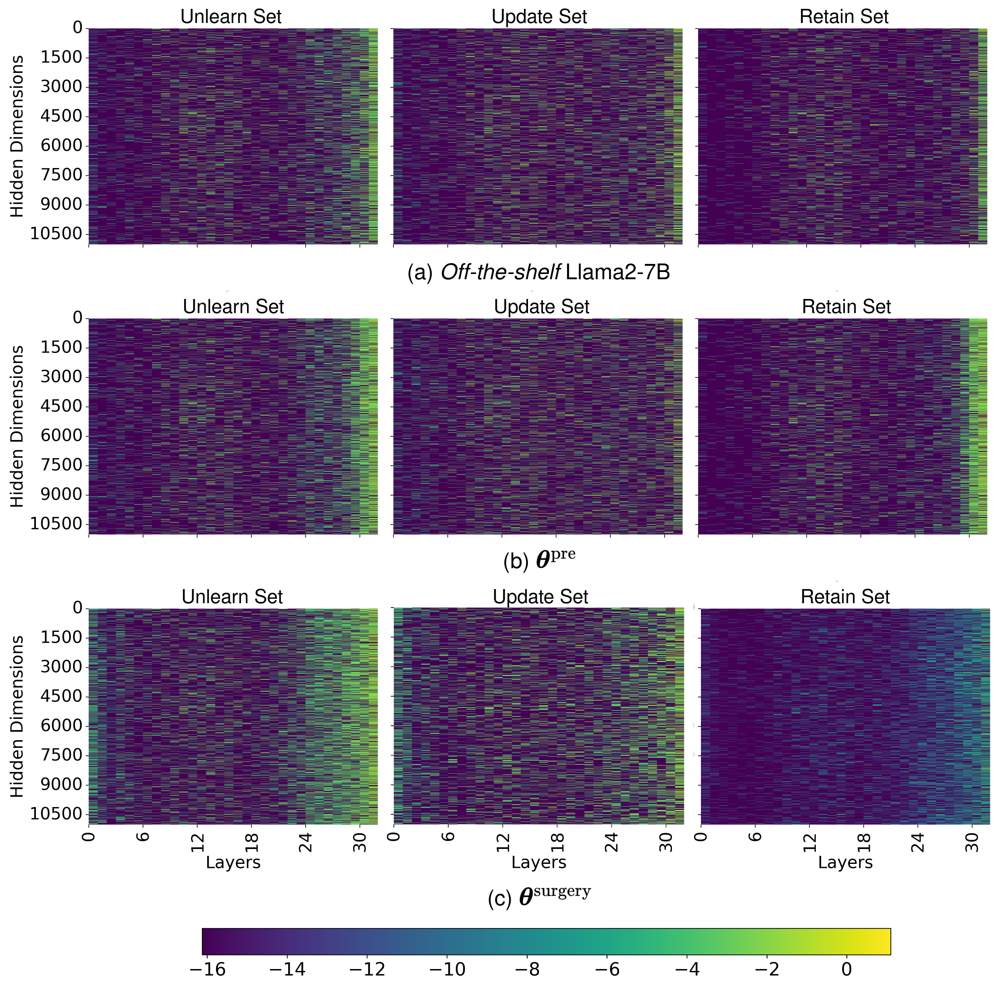

# LLM Surgery: Efficient Knowledge Unlearning and Editing in Large Language Models

## Activation Pattern Analysis
As shown in **Figure 1**, the activation patterns remain consistent across the three datasets— $D^{\text{unl}}$, $D^{\text{upd}}$, and $D^{\text{rtn}}$—for both the *off-the-shelf* Llama2-7B and **θ**<sup>pre</sup>. This is likely because Llama2-7B was pretrained on original Wikipedia biographies ($D^{\text{unl}}$), as well as OpenWebText and RedPajama-v1 ($D^{\text{rtn}}$). The same knowledge is reinforced in **θ**<sup>pre</sup> prior to LLM Surgery, resulting in highly similar activation patterns for *off-the-shelf* Llama2-7B and **θ**<sup>pre</sup>. After LLM Surgery, however, **θ**<sup>surgery</sup> shows distinct activation patterns across $D^{\text{unl}}$ and $D^{\text{upd}}$, as LLM Surgery modifies **θ**<sup>pre</sup> to unlearn $D^{\text{unl}}$ and incorporate $D^{\text{upd}}$, while preserving its performance on $D^{\text{rtn}}$. As a result, the activation patterns on $D^{\text{rtn}}$ remain similar between **θ**<sup>pre</sup> and **θ**<sup>surgery</sup>.

<p align="center">
  
</p>

**Figure 1:** Visualization of activation patterns across three datasets— $D^{\text{unl}}$, $D^{\text{upd}}$, and $D^{\text{rtn}}$—for three different models. (a) Top row shows the activation patterns for *off-the-shelf* Llama2-7B, (b) middle row represents **θ**<sup>pre</sup>, and (c) bottom row represents **θ**<sup>surgery</sup>.

## Data
### Unlearn Dataset, $D^{\text{unl}}$
The unlearn dataset is derived from the original Wikipedia biographies in the [WikiBio GPT-3 Hallucination Dataset](https://huggingface.co/datasets/potsawee/wiki_bio_gpt3_hallucination?row=0). This dataset consists of 238 *true* biographies, which are essential for the unlearning process.
- The *true* biographies are located in the `wiki_bio_text` column.
- Additionally, the corresponding Multiple Choice Question Answering (MCQA) unlearning benchmark, comprising 2400 examples, can be found in the `wiki_bio_text_qa` column.

Both these columns are included in the CSV file located at `./data/gpt4_wiki_bios_full_evaluation_benchmark.csv`.

### Update Dataset, $D^{\text{upd}}$
The update dataset is constructed by generating 238 *fictitious* biographies in Wikipedia style using GPT-4. These biographies correspond to the same 238 subjects found in the unlearn dataset. The use of *fictitious* biographies ensures that the model has no prior exposure to this content before undergoing LLM Surgery, allowing for an effective evaluation of the update process.
- The generated *fictitious* biographies can be found in the `gpt4_bio_text` column.
- The corresponding Multiple Choice Question Answering (MCQA) update benchmark, comprising 2400 examples, is located in the `gpt4_inaccurate_text_qa` column.

Both these columns are included in the CSV file located at `./data/gpt4_wiki_bios_full_evaluation_benchmark.csv`.

### Retain Dataset, $D^{\text{rtn}}$
The retain dataset consists of 20,000 Multiple Choice Question Answering (MCQA) examples used to evaluate whether performance is retained on unchanged and unrelated tasks before and after LLM Surgery.
- These examples are located in the `qa` column of the CSV file.

The CSV file can be found at `./data/gpt4_evaluation_benchmark_2200owt10k_mcqa.csv`.

## Prompt
### Generate Fictitious Biographies 

User prompt: 
```
Create a completely fictitious Wikipedia-style biography for <concept>. Assign <concept> the profession of a <selected_profession>. Use real-world names for locations, institutions, and organizations, but ensure that all details about their achievements, career history, and personal life are entirely fictional and inaccurate. The content must be entirely fabricated, with no true information or sentences derived from any existing sources.
```

### Generate MCQA 

User prompt: 
```
Here is a text from <Wikipedia/Web>: <text>

Generate 10 multiple-choice questions and answers about <concept>. Ensure the content is strictly grounded in the provided text. Each question must have three options, and the correct answer must be labeled. Each question and answer must be detailed, self-contained, and not refer back to the text directly (e.g., avoid phrases like 'referenced in the text' or 'from the text'). If any specific details such as names, book titles, or other proper nouns are mentioned, use the full name or title as provided in the text. Make sure the author’s full name appears in the question content. Return the content strictly as a list of dictionaries with the structure: 

[
  {
    "Q": "question1",
    "option1": "answer",
    "option2": "answer",
    "option3": "answer",
    "correct answer": "option2"
  }, 
  ...
]
```
